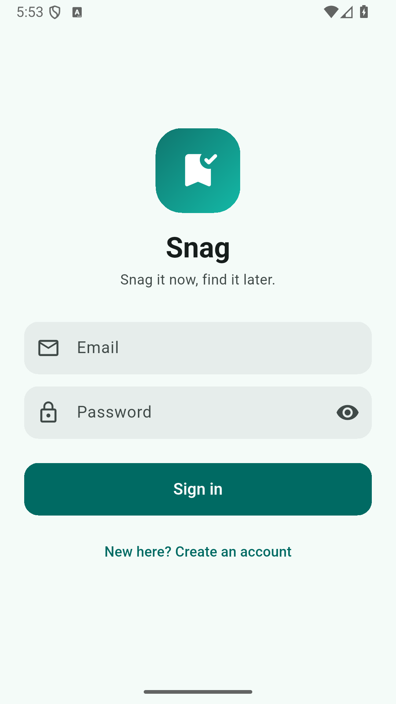

# Snag

**Snag it now, find it later.** Snag is a personal save-for-later app for Android. Its Messenger tab has a pinned **Saved Messages** chat where every note, link, image or PDF you save becomes a bubble. Items sync to your account, so they're the same on every device you sign in on. The **Drive** tab shows your chat attachments in one place.



**Download:** [latest APK from GitHub Releases](https://github.com/dev-lover-codes/Snag/releases/latest)

## Stage reached

Stage 3 + Mission C (plan.md, guaranteed scope):

- Saved Messages with notes, links, images and PDFs; create, view, open, edit, delete, archive and restore; tags; search; type, tag and archive filters.
- Email + password accounts with usernames; cloud sync through Supabase; offline cache; conflict dialog.
- Share text and URLs into Snag from Android's share menu, whether the app is closed or already open.
- Image and PDF attachments in private storage; Drive → **From Chats** (read-only).

The Oct 11 pick (P1–P4) is not built yet. Calendar and Drive → My Files show "Coming soon".

## Tech stack

| Layer | Choice | Why |
|---|---|---|
| App | Flutter + Material 3 | One codebase, fast UI work, a good Android share-intent plugin |
| State | Riverpod | Testable providers; screens stay free of data code |
| Navigation | go_router | Auth redirect, deep links (`/item/:id`), one stack per tab |
| Local cache | drift (SQLite) | Typed queries and reactive streams; the inbox opens instantly and works offline |
| Backend | Supabase (Auth, Postgres + RLS, Storage) | Free plan; privacy enforced in the database, so no custom server |

## How to run

1. Flutter 3.47 (stable) and an Android device or emulator.
2. Copy `env.example.json` to `env.json` and fill in the Supabase **Project URL** and **anon / publishable key**. `env.json` is gitignored.
3. `flutter pub get`
4. `flutter run --dart-define-from-file=env.json`

Release APK: `flutter build apk --release --dart-define-from-file=env.json`. The anon key ends up inside the APK. That key is public by design; Row Level Security protects the data.

If either value is missing, the app shows an "App not configured" screen instead of crashing.

## Architecture

```text
Android Share Sheet ──(shared text / URL)──┐
                                            ▼
FLUTTER APP (Snag)
 ├─ Screens ....... Auth · Messenger · Saved · Detail · Editor · Share · Drive · Profile
 ├─ State ......... Riverpod providers
 ├─ Repositories .. the ONLY door to data
 │    ├─ Local .... drift: per-user cache + drafts
 │    └─ Remote ... supabase_flutter
 └─ Services ...... Share intent · Connectivity
          │  HTTPS + the signed-in user's JWT (anon key only)
          ▼
SUPABASE (free plan)
 ├─ Auth ......... email + password; username in profiles
 ├─ Postgres ..... profiles, items, heartbeat          [RLS on every table]
 └─ Storage ...... chat-files (private)                [user-ID folder policy]
          ▲
UptimeRobot ── reads the heartbeat table every 5 minutes (stops the free-plan pause)
```

Screens never touch drift or Supabase directly. Supabase is the source of truth, and drift is a cache for the signed-in user. The UI always renders from drift streams.

## How authentication works

- Supabase email + password. Sign-up also asks for a username (`^[a-z0-9_]{3,20}$`), checked live with the `is_username_available` RPC. A database trigger stores it in `profiles`.
- The session is kept on the device by `supabase_flutter`, so you stay signed in after restarting the app.
- Email confirmation is **off**, so reviewers can sign up and use the app right away. Trade-off: email addresses are not verified.

## Where data is stored

| Where | What |
|---|---|
| Postgres `items` | Every saved item: id, type, title, content/URL, tags, created/updated dates, archived, version, owner |
| Postgres `profiles` | Username per user |
| Storage `chat-files` (private) | Attachments at `<user_id>/<item_id>/<file_name>`; shown through signed URLs valid for 1 hour |
| drift on the phone | Cache of the signed-in user's items and unsaved drafts; **wiped on logout** |

## How one user's data is protected

- **Row Level Security** on every table: a user can only select, insert, update or delete rows where `owner_id = auth.uid()`.
- **Storage policies** on `chat-files`: the first folder of the path must equal the caller's user id.
- The app ships only the anon key, never the service-role key.
- A deleted item and someone else's item look the same: **"This item no longer exists."**
- Checked against the live project with no login: `items`, `profiles` and the bucket listing all return `[]`. The Account A vs Account B tests are in plan.md §12.2, with screenshots in `docs/screenshots/`.

## Key decisions

- **Repository pattern:** `ItemsRepository` is the only way into data, which keeps screens simple and makes the conflict logic unit-testable with a fake remote.
- **Cache + conflict policy:** updates are conditional on `version`. If another device saved first, you choose **Overwrite** or **Keep theirs**. The most recently saved version wins, but never silently.
- **Offline:** cached items stay readable; writes are disabled with "You're offline — your draft is saved."
- **Stage 1 → 2 migration** clears local-only items, since they had no owner.
- **Saved Messages is the brief's inbox.** Tabs keep separate data; Drive → From Chats only *shows* chat attachments.
- **Keep-alive:** UptimeRobot pings `heartbeat` so the free Supabase project isn't paused.

## Known issues

- The release APK is signed with the default debug key (fine for sideloading). An update built on another machine may need the old version uninstalled first.
- Reminders, Calendar and Drive → My Files are not built yet.

## What's next

Group chats, push notifications, link previews, Drive folders, public share links, data export and account deletion, and sharing images into Snag. See plan.md §14.

## Demo video

_Link to be added._
